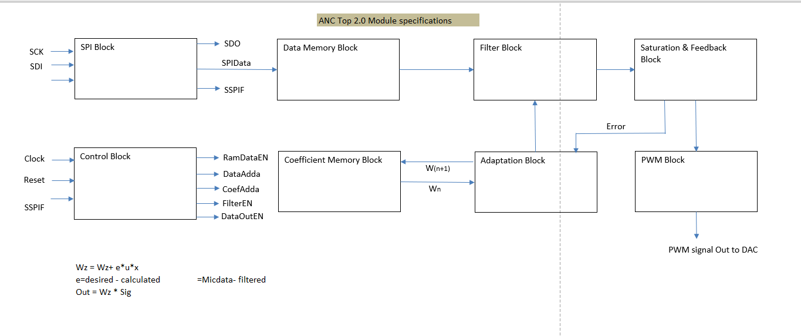

# Active-Noise-Cancellation
Active Noise Cancellation of surrounding noise using dedicated mic to the headset. The inverted signal from the dedicated mic will be added to the actual audio signal to suppress the noise effect for the ears.

## Hardwares used
   FPGA: Spartan XC6SLX9
   MicroChip 18F4550
   PWM to Analogue (Resistor-capasitor) DAC

## SW tools 
   Xilinx ISE v14.2
   MP lab v8.36
   Matlab 2013a for Simulation

### Architecture
System Architecture diagram for the ANC system is

And the Software architecture is

Sample simulation result is [here](Matlab_Simulation/ANCModel.png)

and simulation code [here](/Matlab_Simulation/ANCModel.html)

The project is still under development......
